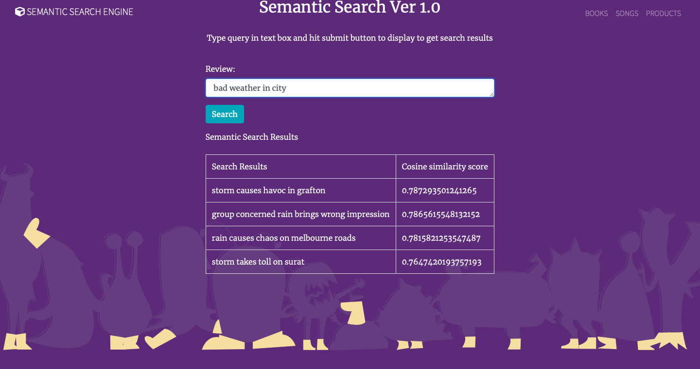

<h1 style="text-align:center;font-size:30px;" >Semantic Search using Sentence BERT: FLASK APP </h1>

Performing semantic search on New document using sentence Bert embeddings and calculating cosine similarity. Showing only top similar query.

<h2>Why choosing SetenceBERT over BERT model? </h2>

- Defaulf word embeddinga for BERT works only for words but not for a complete sentence

<h2>Sentence Transformer</h2>

- modified verson of BERT
- Uses siamese and triplet network structure to derive usefull embeddings that can be compared easily using cosine similarity.

